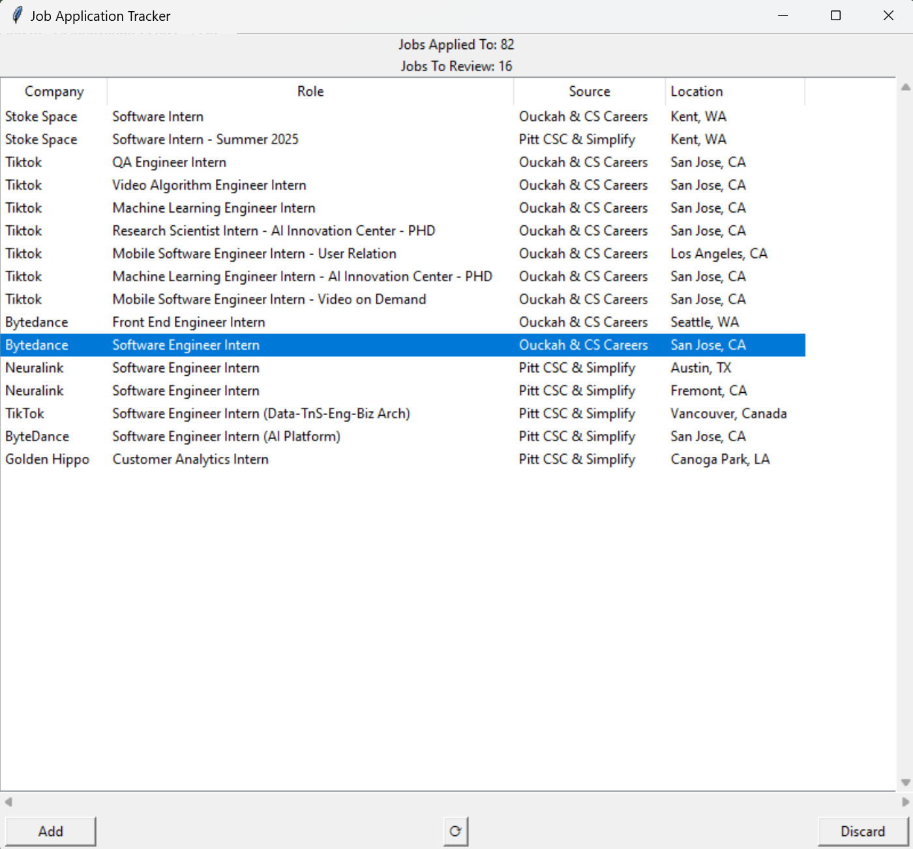

### Description

I got really lazy to check which jobs I've applied to and not applied to from the two current GitHub repos: https://github.com/Ouckah/Summer2025-Internships and https://github.com/SimplifyJobs/Summer2025-Internships. So I made this application which allows you to track which jobs you've applied to from  GitHub repos and only shows job listings that you have not applied to. 

It attempts to remove duplicate listings between different job boards (there are still some duplicates - I'm taking the approach of only removing guaranteed duplicates to avoid accidental removal of a job listing you've not applied to), and you can refresh program/open it again to see which jobs you have not reviewed yet - this way, you can be 100% sure you have not missed a job listing.

You can either add a job listing or discard it, and it will put it in Google Sheets in the corresponding tab for you to track (and the application uses this as a database, so you can see it wherever you go). You can double click on any job listing to open it, or right click on a listing to copy the job listing URL.

### Current job duplication check between different job boards
If any of the below is true, a job is considered to be duplicate and only the first listing that the program runs through is shown:
1. If a previous job listing shown has the same URL
2. If a previous job listing has the same company name, job title, and location (all have to match together)

### Installation
1. Clone repository to your directory.
2. Setup and activate your virtual environment (optional but highly recommended) using `python -m venv venv`
3. Install requirements using `pip install -r requirements.txt`
4. Follow `gspread` installation requirements found at: https://docs.gspread.org/en/v6.1.2/oauth2.html#for-end-users-using-oauth-client-id **Make sure to follow the guide for: (For end users: Using OAuth Client ID)**. Save your key wherever you'd like and put the location inside `settings.py` inside **KEY_FILE_PATH**.
5. Clone this Google Sheet: https://docs.google.com/spreadsheets/d/1oOwbW--483RkdXymdyyHRpCnuzcJ-7JkdGZEF8c_1nw/edit?usp=sharing
6. Feel free to add any columns you want, but **don't modify** the current columns order, or the worksheet names (Applied and Ignore)
7. Make sure to grant your OAuth App access to this Google Sheet. Find the Google Sheet spreadsheet key, and put it in a file. Then, put the file location inside `settings.py` in **SHEET_KEY_FILE**.
8. Run with `python gui.py`

### To-do / Potential future updates
1. Add a tab list to manage/view current applications as well. 
2. More advanced URL detection matching to remove more duplicate job listings from different job boards.
3. Multiselect capability.
4. Look into making backend be thread safe; or emulating it in a way so that buttons don't need to be blocked while adding/discarding a job.
5. Compile it into .exe for easier file opening.
